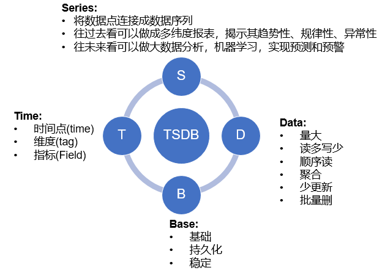
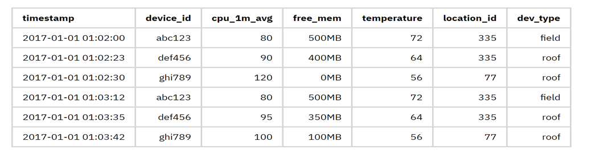
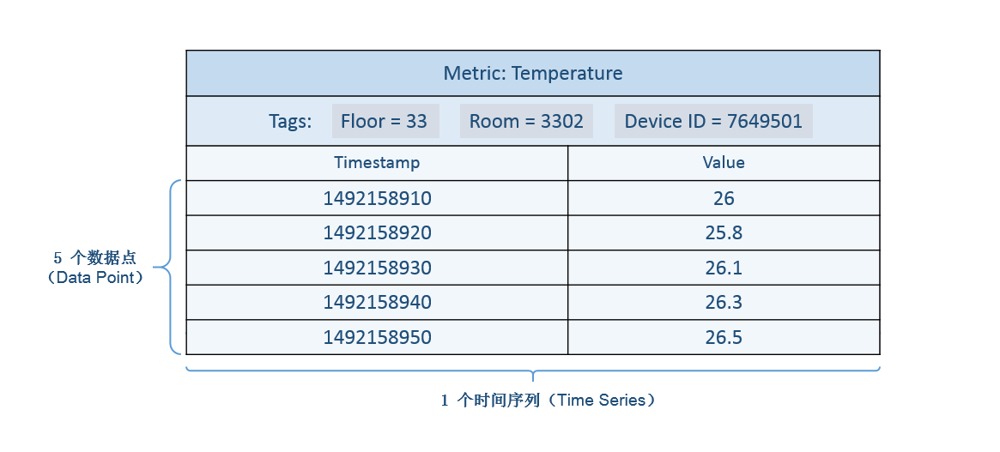

# 时间序列数据库 TSDB


## 背景


这两年互联网行业掀着一股新风，总是听着各种高大上的新名词。大数据、人工智能、物联网、机器学习、商业智能、智能预警啊等等。

以前的系统，做数据可视化，信息管理，流程控制。现在业务已经不仅仅满足于这种简单的管理和控制了。数据可视化分析，大数据信息挖掘，统计预测，建模仿真，智能控制成了各种业务的追求。

*“所有一切如泪水般消失在时间之中，时间正在死去“*，以前我们利用互联网解决现实的问题。现在我们已经不满足于现实，数据将连接成时间序列，可以往前可以观其历史，揭示其规律性，往后可以把握其趋势性，预测其走势。

**于是，我们开始存储大量时间相关的数据(如日志，用户行为等)，并总结出这些数据的结构特点和常见使用场景，不断改进和优化，创造了一种新型的数据库分类——时间序列数据库(Time Series Database).**

## 时间序列模型

时间序列数据库主要用于指处理带时间标签（按照时间的顺序变化，即时间序列化）的数据，带时间标签的数据也称为时间序列数据。

每个时序点结构如下：

- **timestamp:** 数据点的时间，表示数据发生的时间。
- **metric:** 指标名，当前数据的标识，有些系统中也称为name。
- **value:** 值，数据的数值，一般为double类型，如cpu使用率，访问量等数值，有些系统一个数据点只能有一个value，多个value就是多条时间序列。有些系统可以有多个value值，用不同的key表示
- **tag:** 附属属性。 




## 实现

比如我想记录一系列传感器的时间序列数据。数据结构如下：

```
* 标识符：device_id，时间戳
* 元数据：location_id，dev_type，firmware_version，customer_id
* 设备指标：cpu_1m_avg，free_mem，used_mem，net_rssi，net_loss，电池
* 传感器指标：温度，湿度，压力，CO，NO2，PM10
```


如果使用传统RDBMS存储，建一张如下结构的表即可：




如此便是一个最简单的时间序列库了。但这只是满足了数据模型的需要。**我们还需要在性能，高效存储，高可用，分布式和易用性上做更多的事情。**

大家可以思考思考，如果让你自己来实现一个时间序列数据库，你会怎么设计，你会考虑哪些性能上的优化，又如何做到高可用，怎样做到简单易用。


## ALibaba TSDB

时序数据库产品系列是是广泛应用于物联网（IoT）设备监控系统 ，企业能源管理系统（EMS），生产安全监控系统，电力检测系统等行业场景的专业数据库产品，提供百万高效写入，高压缩比低成本存储、预降采样、插值、多维聚合计算，查询结果可视化功能；解决由于设备采集点数量巨大，数据采集频率高，造成的存储成本高，写入和查询分析效率低的问题。


有2个版本：

+ TSDB
+ Influxdb 

### TSDB


TSDB是一个分布式时序数据库，具备多副本高可用能力。同时在高负载大规模数据量的情况下可以方便地进行弹性扩容，方便用户结合业务流量特点进行动态规划与调整。


#### 产品功能


##### 时序数据高效读写

TSDB 提供时序数据的高效读写。对于百万数据点的读取，响应时间小于 5 秒，且最高可以支撑每秒千万数据点的写入。

- **数据写入**
  - TSDB 支持通过 HTTP 协议 和 TSDB Java Client 两种方式进行数据写入。
- **数据查询**
  - TSDB 支持通过 HTTP 协议、TSDB Java Client 以及 TSDB 控制台三种方式进行数据的查询操作。用户也可以通过 TSDB 产品控制台的数据查询功能进行数据分组、降采样、空间聚合的可视化数据查询展现。

##### 数据管理

- **数据时效设置**
  - 您可以通过控制台或者 API 设置数据的有效期。数据时效开启并设置完成后，系统对于定义的过期数据将立即标记失效，并在特定时间进行自动化清理。
- **数据清理**
  - 您可以在控制台上根据度量（Metric）进行数据清理，或者通过 API 进行更灵活的数据清理。

##### 高效压缩存储

​		TSDB 使用高效的数据压缩技术，将单个数据点的平均使用存储空间降为1~2个字节，可以降低90%存储使用空间，同时加快数据写入的速度。

##### 时序数据计算能力

​		TSDB 提供专业全面的时序数据计算函数，支持降采样、数据插值和空间聚合计算，能满足各种复杂的业务数据查询场景。

##### 监控运维

​		TSDB 提供实例运维系统，让您可以实时的掌握实例的运行情况、性能指标和存储空间使用情况，并通过设置报警通道，实时发现资源瓶颈。

##### 数据和实例安全

​		TSDB 提供以下方案保证您的数据和实例的安全：

+ 提供 VPC 的实例访问方式，充分保证实例访问的安全性。
+ 提供网络白名单功能：您可以通过设置允许访问实例的机器名单，进一步保证实例和数据的访问安全。如果一台机器在 VPC 内部，但不在设置的白名单内，则不能访问实例。
+ TSDB 的数据存储默认采取三副本策略，充分保证数据的可用性。

##### 流计算支持

TSDB 已与阿里云流计算（StreamCompute）产品集成。


#### 名词解释


+ 时序数据库 TSDB ：英文全称为 Time Series Database，提供高效存取时序数据和统计分析功能的数据管理系统。

+ 时序数据（Time Series Data）：基于稳定频率持续产生的一系列指标监测数据。例如，监测某城市的空气质量时，每秒采集一个二氧化硫浓度的值而产生的一系列数据。(一个主键为时间戳的二维表)

+ 度量（Metric）：监测数据的指标，例如风力和温度。

+ 标签（Tag）：度量（Metric）虽然指明了要监测的指标项，但没有指明要针对什么对象的该指标项进行监测。标签（Tag）就是用于表明指标项监测针对的具体对象，属于指定度量下的数据子类别。

  一个标签（Tag）由一个标签键（TagKey）和一个对应的标签值（TagValue）组成，例如“城市（TagKey）= 杭州（TagValue）”就是一个标签（Tag）。更多标签示例：机房 = A 、IP = 172.220.110.1。

  **注意：**当标签键和标签值都相同才算同一个标签；标签键相同，标签值不同，则不是同一个标签。

  在监测数据的时候，指定度量是“气温”，标签是“城市 = 杭州”，则监测的就是杭州市的气温。

+ 标签键（TagKey，Tagk）：为指标项（Metric）监测指定的对象类型（会有对应的标签值来定位该对象类型下的具体对象），例如国家、省份、城市、机房、IP 等。

+ 标签值（TagValue，Tagv）：标签键（TagKey）对应的值。例如，当标签键（TagKey）是“国家”时，可指定标签值（TagValue）为“中国”。

+ 值（Value）：度量对应的值，例如 15 级（风力）和 20 ℃（温度）。

+ 时间戳（Timestamp）：数据（度量值）产生的时间点。

+ 数据点 (Data Point)：针对监测对象的某项指标（由度量和标签定义）按特定时间间隔（连续的时间戳）采集的每个度量值就是一个数据点。“一个度量 + N 个标签（N >= 1）+ 一个时间戳 + 一个值”定义一个数据点。

+ 时间序列（Time Series）：针对某个监测对象的某项指标（由度量和标签定义）的描述。“一个度量 + N 个标签KV组合（N >= 1）”定义为一个时间序列，某个时间序列上产生的数据值的增加，不会导致时间序列的增加。 时间序列的示意图如下：

  

+ 时间线（Timeline）：等同于时间序列的概念。
+ 时间精度：时间线数据的写入时间精度——毫秒、秒、分钟、小时或者其他稳定时间频度。例如，每秒一个温度数据的采集频度，每 5 分钟一个CPU使用率的采集频度。
+ 数据组（Data Group）：如果需要对比不同监测对象（由标签定义）的同一指标（由度量定义）的数据，可以按标签这些数据分成不同的数据组。例如，将温度指标数据按照不同城市进行分组查询，操作类似于该 SQL 语句：select temperature from xxx group by city where city in （shanghai, hangzhou)。
+ 聚合（ Aggregation）：当同一个度量（Metric）的查询有多条时间线产生（多个指标采集设备），那么为了将空间的多维数据展现为成同一条时间线，需要进行合并计算，例如，当选定了某个城市某个城区的污染指数时，通常将各个环境监测点的指标数据平均值作为最终区域的指标数据，这个计算过程就是空间聚合。
+ 降采样（Downsampling）：当查询的时间区间跨度较长而原始数据时间精度较细时，为了满足业务需求的场景、提升查询效率，就会降低数据的查询展现精度，这就叫做降采样，比如按秒采集一年的数据，按照天级别查询展现。
+ 数据时效（Data’s Validity Period）：数据时效是设置的数据的实际有效期，超过有效期的数据会被自动释放。


#### 使用限制


##### 实例规格限制

TSDB 目前提供的最大实例规格为 旗舰版 II。如果您需要超过该规格的实例，请提交工单申请开通。

##### 使用限制

TSDB 处于实例保护的目的，根据不同的实例规格的资源情况，对某些具体使用量进行了约束，您在使用 TSDB 时注意不要超过相应的限制值，以免系统出现异常，如果应用层面收到超出规格限制的异常提示，请直接在官网 TSDB 产品控制台升级产品规格即可。具体的限制项和限制值请参见下表。


|  产品规格  | 时间线标签数量上限 | **单个子查询覆盖时间线上限（万）** | 单个子查询覆盖数据点上限（万） | 单个子查询返回结果数据点数上限（万） | QPS上限 |
| :--------: | :----------------: | :--------------------------------: | :----------------------------: | :----------------------------------: | ------- |
|  基础版 I  |         16         |                 10                 |              700               |                  15                  | 200     |
| 基础版 II  |         20         |                 15                 |              700               |                  20                  | 1000    |
| 基础版 III |         20         |                 20                 |              700               |                  20                  | 1200    |
|  标准版 I  |         20         |                 80                 |              2000              |                  80                  | 4000    |
| 标准版 II  |         24         |                120                 |              4000              |                 160                  | 8000    |
|  旗舰版 I  |         24         |                160                 |              6000              |                 180                  | 24000   |
| 旗舰版 II  |         24         |                200                 |              8000              |                 200                  | 50000   |

##### 说明：

+ 子查询： 每个时序查询 Query 里可以存在多个子查询 Query，实现批查询。
+ 子查询覆盖时间线：每个子查询到下发到引擎层后命中的时间线总量。
+ 子查询覆盖数据点：每个子查询下发到存储层后，需要扫描和计算的数据点总量。
+ 子查询结果返回数据点数：每个子查询在经过时序聚合计算后，返回到应用层的数据点数量。
+ QPS上限: 此处QPS测量的查询基准为 以5分钟作为查询的时间范围扫描一条按每10秒上报一条数据的时间线(只含一个Tag的单值数据)的查询

##### 注意事项：

单次查询中，如果包含多个子查询，其中某个子查询触发了实例对于子查询的限制，那么整个请求查询失败，返回异常。这种情况可以修改查询条件，或者升级实例规格。

#### 常见问题

##### 如何选择 TSDB 的实例规格？

您可根据以下两个指标选择 TSDB 的实例规格：

- 时间线数：对应设备上的采集点数。一个采集点可以是某个设备上需要上传数据的一个传感器。计算公式：设备规模（总设备数） * 单个设备的采集点数或传感器数。
- 写入效率：全局每秒需要写入时序数据库的平均数据点数（数据记录数）。计算公式：时间线数 * 单条时间线每秒需要写入的平均数据点数。


